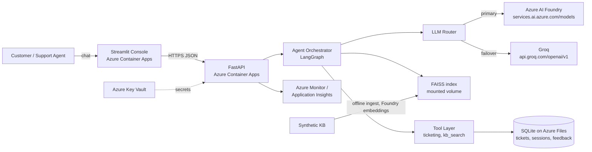
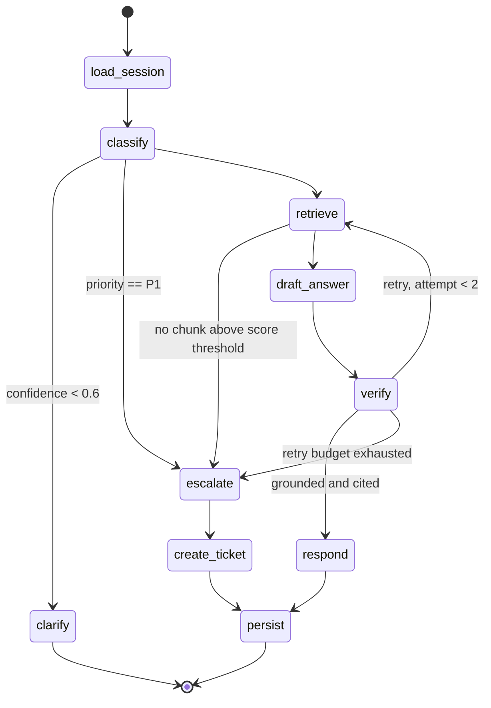
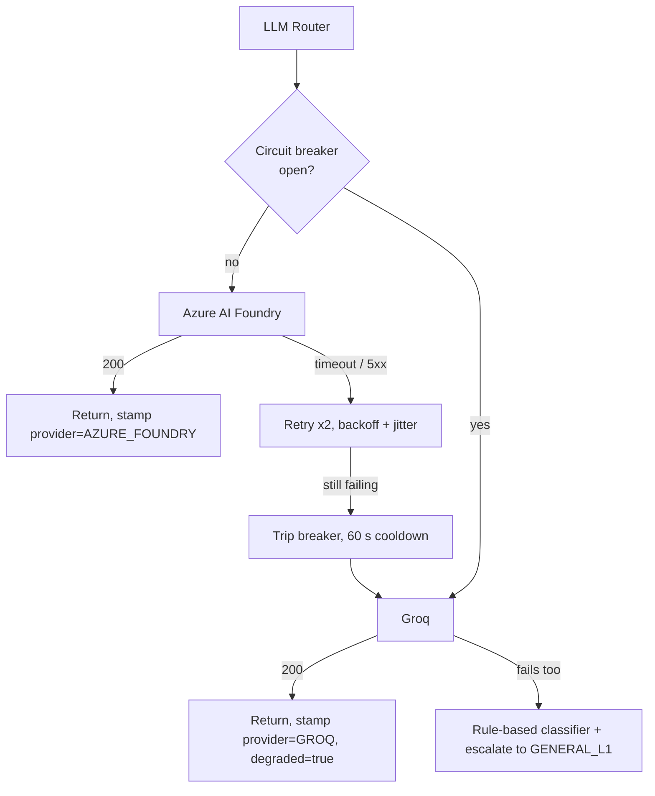
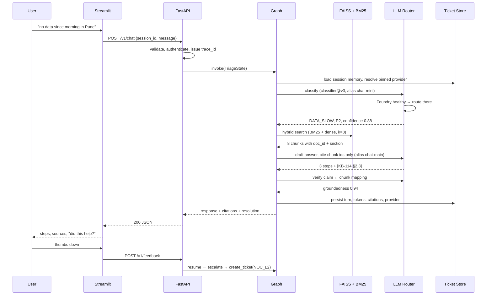
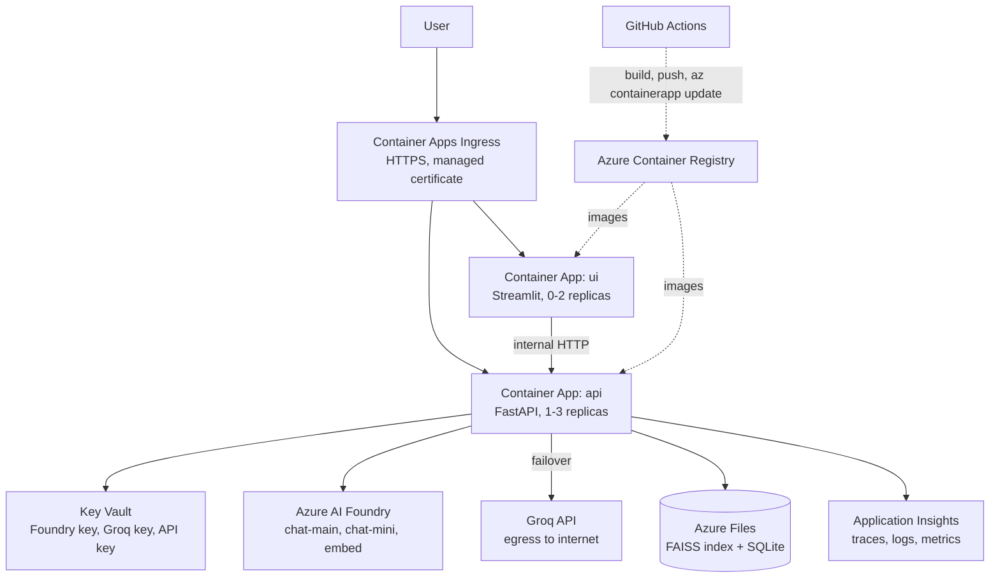

# Telecom Support Agent — Network Issue Triage & Escalation

An agentic support assistant for a telecom operator. It classifies an inbound customer
issue, retrieves grounded troubleshooting guidance from an approved knowledge base,
attempts resolution, and escalates unresolved or high-priority cases to the correct
support queue with a simulated ticket.

| | |
|---|---|
| **Timeline** | 7 days, 5 engineers |
| **Cloud** | Microsoft Azure |
| **Primary LLM** | Azure AI Foundry (models inference endpoint) |
| **Backup LLM** | Groq (OpenAI-compatible API) |
| **Embeddings** | Azure AI Foundry, **ingestion-time only** — see §4 |
| **Vector store** | FAISS (local file, published as a release artifact) |
| **Data** | Synthetic only. No customer, client or participant data, anywhere, ever |

---

## Table of Contents

1. [Problem Statement & Scope](#1-problem-statement--scope)
2. [High Level Design](#2-high-level-design-hld)
3. [Agent Workflow](#3-agent-workflow-langgraph)
4. [Model Strategy: Foundry Primary, Groq Failover](#4-model-strategy-foundry-primary-groq-failover)
5. [Request Lifecycle](#5-request-lifecycle-end-to-end)
6. [Failure Handling Matrix](#6-failure-handling-matrix)
7. [API Contract](#7-api-contract)
8. [Repository Structure](#8-repository-structure)
9. [Team Roles & Ownership](#9-team-roles--ownership)
10. [GitHub Projects Workflow](#10-github-projects-workflow)
11. [7-Day Delivery Plan](#11-7-day-delivery-plan)
12. [Scope Cuts — What We Deliberately Are Not Building](#12-scope-cuts--what-we-deliberately-are-not-building)
13. [Local Setup](#13-local-setup)
14. [LLMOps Strategy](#14-llmops-strategy)
15. [Observability](#15-observability)
16. [Responsible AI Controls](#16-responsible-ai-controls)
17. [Azure Deployment Design](#17-azure-deployment-design)
18. [Cost Model](#18-cost-model)
19. [Risks](#19-risks)

---

## 1. Problem Statement & Scope

### The business problem

A telecom support desk receives high-volume, low-complexity contacts (APN
misconfiguration, recharge failure, SIM activation delay) mixed with genuinely complex
ones (regional outage, roaming partner failure, billing dispute). Human agents spend
most of their handle time searching runbooks for the easy 70%, which starves the hard
30% of attention.

### What this system does

| In scope | Out of scope |
|---|---|
| Classify issue into category + priority | Real network telemetry ingestion |
| Retrieve troubleshooting steps with citations | Real CRM / OSS-BSS integration |
| Guide the customer through resolution | Actual billing adjustments or refunds |
| Create a simulated ticket and route it | Voice / IVR channel |
| Escalate on low confidence or high priority | Multilingual support |
| Remember context within a session | Cross-session customer history |

### Design principle

**Escalation is the safe default.** The system answers only when it can cite an
approved source. Anything it cannot ground becomes a ticket for a human. This single
decision satisfies "answer-not-found behaviour", "human review for high-risk outputs"
and "escalation routing" from three separate rubric rows.

---

## 2. High Level Design (HLD)

### 2.1 System context



### 2.2 Container view and responsibilities

| Container | Responsibility | Must NOT do | Owner |
|---|---|---|---|
| Streamlit UI | Render chat, citations, ticket panel, feedback, degraded-mode banner | Call an LLM directly, hold business logic | M4 |
| FastAPI | Validation, auth, rate limit, tracing, orchestration entry | Contain prompt text or retrieval logic | M3 |
| Agent orchestrator | Graph, routing policy, state transitions, budget enforcement | Know about HTTP or Streamlit | M1 |
| LLM router | Provider selection, failover, circuit breaker, token accounting | Contain prompt text | M1 + M5 |
| RAG subsystem | Ingestion, chunking, embedding, hybrid retrieval | Generate final answers | M2 |
| Tool layer | Side effects: create/read tickets, escalate | Make LLM calls | M3 |
| Store | Persistence + repository interfaces | Contain domain rules | M3 |
| Observability | Structured logs, OTel spans to App Insights, cost accounting | Be bolted on at the end | M5 |

### 2.3 Dependency rule (enforced in code review)

```
api  →  agent  →  { rag, tools, memory, prompts, llm }  →  store  →  config/core
```

Arrows point one way only. A reverse import is a blocking review comment.
`core/` and `config/` may be imported by anything and import nothing internal.

### 2.4 Non-functional targets

| Attribute | Target | Measured by |
|---|---|---|
| Latency p95, resolve path | < 6 s (Foundry) · < 4 s (Groq, it is faster) | OTel span on `/v1/chat` |
| Latency p95, escalate path | < 9 s | includes verifier + ticket write |
| Retrieval recall@5 | ≥ 0.85 on golden set | `evals/runners/run_retrieval.py` |
| Classification accuracy | ≥ 0.90 category · ≥ 0.85 priority | confusion matrix in eval report |
| Groundedness | ≥ 0.90 of answered turns fully cited | verifier + citation coverage |
| Escalation recall on P1 | **1.00 — no misses tolerated** | `evals/datasets/escalation.jsonl` |
| Cost | ≤ 12 000 tokens per session | per-node token accounting |
| Failover time | < 20 s from first Foundry failure to Groq serving | failover drill on Day 4 |

---

## 3. Agent Workflow (LangGraph)

### 3.1 Graph



### 3.2 Shared state schema

Defined once in `src/telecom_agent/agent/state.py`. Nodes return a partial update of
this object and never mutate globals.

```python
class TriageState(TypedDict, total=False):
    # --- identity & tracing ---
    session_id: str            # groups turns into one conversation
    trace_id: str              # correlates logs, spans and DB rows
    # --- provider pinning (see §4) ---
    provider: Provider         # AZURE_FOUNDRY | GROQ — fixed for the whole session
    degraded: bool             # True when serving from the backup provider
    # --- conversation ---
    messages: list[Message]    # rolling window, trimmed by memory policy
    customer_ctx: CustomerCtx  # synthetic: circle, plan, device, prepaid/postpaid
    # --- classification output ---
    category: IssueCategory    # NETWORK_COVERAGE, BILLING_DISPUTE, SIM_ACTIVATION, ...
    priority: Priority         # P1 outage → P4 informational
    confidence: float          # classifier self-report, gates the clarify branch
    entities: dict             # extracted APN, circle, amount, ICCID, ...
    # --- retrieval output ---
    retrieved: list[Chunk]     # chunk text + doc_id + section + score
    citations: list[Citation]  # only chunks actually referenced in the answer
    # --- generation & verification ---
    draft: str
    groundedness: float        # verifier score, gates respond vs escalate
    attempt: int               # retry counter, hard capped to stop cost loops
    # --- outcome ---
    resolution: Resolution     # RESOLVED | NEEDS_INFO | ESCALATED
    ticket: Ticket | None
    queue: EscalationQueue | None   # NOC_L2, BILLING_OPS, SIM_PROVISIONING, ...
    # --- budget ---
    token_usage: TokenUsage    # accumulated per node, enforced against session cap
```

### 3.3 Taxonomies (single source of truth: `core/enums.py`)

**Categories:** `NETWORK_COVERAGE`, `DATA_SLOW`, `CALL_DROP`, `BILLING_DISPUTE`,
`RECHARGE_PAYMENT_FAILED`, `SIM_ACTIVATION`, `SIM_SWAP_PORTING`, `ROAMING`,
`VAS_SUBSCRIPTION`, `DEVICE_CONFIG`, `ACCOUNT_KYC`, `OTHER`

**Priority:** `P1` no service / suspected outage · `P2` severely degraded ·
`P3` billing or provisioning dispute · `P4` informational

**Queues:** `NOC_L2`, `BILLING_OPS`, `SIM_PROVISIONING`, `ROAMING_PARTNER_DESK`,
`RETENTION`, `GENERAL_L1`

Routing is a **declarative table** in `agent/policies/routing.py`, not `if/else` inside
a node. Adding a queue must not require touching the graph.

---

## 4. Model Strategy: Foundry Primary, Groq Failover

### 4.1 Why two providers

Foundry gives us enterprise posture: private networking, Entra ID, content filtering,
Azure Monitor integration, one bill. Groq gives us a fallback that is independent of
our Azure subscription — which matters when a shared training subscription hits a quota
wall the night before a demo. Groq is also dramatically faster, so degraded mode is
faster, not slower. The trade is that Groq is a different vendor boundary with different
models, so outputs will not be identical.

### 4.2 Deployment aliases, not model names

The Foundry models inference endpoint has the form
`https://<resource-name>.services.ai.azure.com/models` and routes a request to a
deployment by matching the `model` parameter against the **deployment name**. We exploit
that: code refers to stable aliases, so a model upgrade is a portal change rather than a
code change.

| Alias used in code | Foundry deployment | Groq equivalent | Used by |
|---|---|---|---|
| `chat-main` | a GPT-4.1-class deployment | `openai/gpt-oss-120b` | `draft_answer`, `verify` |
| `chat-mini` | a GPT-4.1-mini-class deployment | `llama-3.1-8b-instant` | `classify`, `clarify` |
| `embed` | `text-embedding-3-small` | **none — see below** | ingestion only |

Confirm current Groq production model IDs against `https://api.groq.com/openai/v1/models`
before you hardcode anything; the catalogue and its deprecations move quickly.

### 4.3 The asymmetry that shapes the architecture

**Groq has no embeddings endpoint.** Its production catalogue is chat plus audio.
So the failover is asymmetric: chat fails over, embeddings do not.

This is fine — and it is why the pipeline is designed the way it is:

- Embeddings are needed **only at ingestion time**, never on the query path.
- `make ingest` runs once, calls the Foundry `embed` deployment, writes `data/index/`.
- The built index is published as a **GitHub Release artifact**, so no teammate and no
  container ever needs to re-embed, and the demo cannot be broken by an embedding outage.
- Consequence: query-time RAG depends on FAISS + BM25 only. Both are local. Both work
  offline. This is the single biggest reliability win available in a 7-day project.

Alternative considered and rejected for this timeline: a local sentence-transformer
(`bge-small-en-v1.5`) removes the Azure dependency entirely but adds ~120 MB to the
image and a second embedding quality to evaluate. Recorded in `docs/adr/0004`.

### 4.4 Failover semantics



Four rules, each of which exists because violating it causes a specific bug:

1. **Pin the provider per session, never per call.** Failing over mid-graph means the
   classifier and the verifier are different models reasoning about the same turn. The
   verifier then rejects a perfectly good answer, the retry burns budget, and the trace
   is nearly unreadable. Set `state["provider"]` in `load_session` and honour it.
2. **Stamp `provider` and `model` on every response and every log line.** Otherwise
   "why was this answer bad?" is unanswerable after the fact.
3. **Keep prompts provider-agnostic and validate with Pydantic either way.** Do not rely
   on a vendor-specific structured-output feature for the classifier. Ask for strict JSON,
   parse it, and keep one repair-prompt retry. Open-weight models are usually good at this
   but not identically good.
4. **Treat degraded mode as visible, not silent.** A banner in the UI, a
   `llm_failover_total` counter, and a separate eval baseline. Silent quality changes are
   how teams lose a rubric point they never knew they dropped.

### 4.5 Both baselines, not one

`evals/baselines/` holds `foundry.json` **and** `groq.json`. CI compares like with like.
A number that only exists for the primary provider tells you nothing about the path your
demo might actually run on.

---

## 5. Request Lifecycle (end to end)



---

## 6. Failure Handling Matrix

Design this **before** writing nodes. Every row becomes a test in `tests/integration/test_failure_modes.py`.

| Failure | Detection | Response | Owner |
|---|---|---|---|
| Foundry timeout / 5xx | client timeout 20 s | 2 retries with backoff + jitter | M1 |
| Foundry quota / 429 | status + `Retry-After` | trip breaker immediately, go to Groq | M5 |
| Foundry content filter blocks | specific error code | do not retry, escalate with reason logged | M5 |
| Both providers down | breaker open on both | rule-based keyword classifier → `GENERAL_L1` | M1 |
| Groq model deprecated / 404 | startup readiness probe | `readyz` fails loudly at deploy, not at demo | M5 |
| Retrieval returns nothing above threshold | `max(score) < 0.35` | answer-not-found message + escalate | M2 |
| Verifier fails twice | `attempt >= 2` | stop generating, escalate with draft attached for human review | M1 |
| Malformed LLM JSON | Pydantic validation error | one repair prompt, then rule-based fallback | M1 |
| SQLite lock contention | `database is locked` | WAL mode + short retry; single writer per container | M3 |
| Duplicate ticket on retry | idempotency key `sha256(session_id + category + hour_bucket)` | return existing ticket, never create a second | M3 |
| Runaway loop | `attempt` cap + session token cap | terminate graph, escalate, log budget breach | M5 |
| Prompt injection in user text | input scanner + system-prompt isolation | strip, log, never let user text reach tool arguments | M5 |

---

## 7. API Contract

Versioned under `/v1`. Reference in `docs/api-contract.md`; OpenAPI is generated and
committed so breaking changes show up in diffs.

| Method | Path | Purpose |
|---|---|---|
| `POST` | `/v1/chat` | Main workflow: full triage turn, returns answer + citations + resolution |
| `POST` | `/v1/classify` | Classification only; used by evals and the UI debug drawer |
| `POST` | `/v1/tickets` | Simulated ticket creation (idempotent) |
| `GET` | `/v1/tickets/{ticket_id}` | Ticket status and audit trail |
| `GET` | `/v1/tickets` | Filter by queue, priority, status |
| `POST` | `/v1/feedback` | Thumbs up/down + free text, keyed to `trace_id` |
| `GET` | `/healthz` | Liveness. No dependency checks |
| `GET` | `/readyz` | Readiness: index loaded, DB writable, **both** LLM providers probed |
| `GET` | `/metrics` | Prometheus exposition (also shipped to App Insights) |

**`POST /v1/chat` — response shape**

```json
{
  "trace_id": "01JBX...",
  "session_id": "sess_8f2a",
  "category": "DATA_SLOW",
  "priority": "P2",
  "resolution": "RESOLVED",
  "answer": "Three steps to restore data service ...",
  "citations": [
    { "doc_id": "KB-114", "title": "APN reset – Android", "section": "2.3", "score": 0.81 }
  ],
  "ticket": null,
  "llm": { "provider": "AZURE_FOUNDRY", "alias": "chat-main", "degraded": false },
  "usage": { "prompt_tokens": 2841, "completion_tokens": 402, "est_cost_usd": 0.0091 },
  "latency_ms": 4180
}
```

**Error envelope** — identical everywhere, so the UI has one code path:

```json
{ "error": { "code": "RETRIEVAL_EMPTY", "message": "...", "trace_id": "01JBX...", "retryable": false } }
```

---

## 8. Repository Structure

```text
telecom-support-agent/
│
├── README.md                       # this file: HLD, roles, 7-day plan, setup
├── pyproject.toml                  # single source for deps, ruff/mypy/pytest config
├── uv.lock                         # pinned dependency graph, reproducible installs
├── Makefile                        # one-word entrypoints: make dev / test / eval / ingest
├── .env.example                    # every env var the app reads, with dummy values
├── .gitignore                      # excludes .env, data/index/, *.db, __pycache__
├── .pre-commit-config.yaml         # ruff + secret scan before every commit
├── CODEOWNERS                      # maps directories to reviewers, auto-requests review
├── CONTRIBUTING.md                 # branch naming, commit format, PR checklist
│
├── .github/                        # GitHub-native automation and templates
│   ├── workflows/                  # CI/CD pipeline definitions
│   │   ├── ci.yml                  # ruff + mypy + pytest on every PR (must stay under 3 min)
│   │   ├── eval.yml               # golden-set regression; blocks PRs that lower scores
│   │   ├── docker.yml              # build and push both images to Azure Container Registry
│   │   └── deploy.yml              # az containerapp update on merge to main
│   ├── ISSUE_TEMPLATE/             # forces consistent, gradeable issue descriptions
│   │   ├── task.yml                # user story + acceptance criteria + Definition of Done
│   │   └── bug.yml                 # repro steps, expected vs actual, trace_id
│   └── PULL_REQUEST_TEMPLATE.md    # linked issue, tests, eval delta, screenshot
│
├── docs/                           # design artefacts the graders read first
│   ├── hld.md                      # expanded architecture and NFRs
│   ├── api-contract.md             # endpoint reference, schemas, error codes
│   ├── openapi.json                # generated spec, committed to track breaking changes
│   ├── agent-workflow.md           # graph explanation, node contracts, state transitions
│   ├── model-strategy.md           # Foundry/Groq routing, aliases, failover semantics
│   ├── azure-deployment.md         # resource inventory, network, identity, secrets
│   ├── responsible-ai.md           # RAI checklist with evidence per control
│   ├── runbook.md                  # on-call: symptoms → checks → remediation
│   ├── cost-model.md               # token maths for both providers, monthly projection
│   ├── demo-script.md              # exact click path and prompts for the final demo
│   ├── adr/                        # architecture decision records, one per real choice
│   │   ├── 0001-langgraph-over-plain-chains.md  # why a state machine, cycles, conditional exits
│   │   ├── 0002-hybrid-retrieval.md             # why BM25 + dense for error codes and plan names
│   │   ├── 0003-groq-as-failover.md             # why a second vendor, provider pinning, dual baselines
│   │   └── 0004-embeddings-at-ingest-only.md    # why Groq's missing embeddings does not matter
│   └── diagrams/                   # editable diagram sources, not just exported PNGs
│       ├── context.mmd             # system context diagram source
│       ├── azure-deployment.mmd    # Azure resource topology source
│       └── agent-graph.mmd         # LangGraph node and edge source
│
├── src/
│   └── telecom_agent/              # the installable package; all runtime code
│       ├── __init__.py             # package version marker
│       │
│       ├── api/                    # HTTP boundary. Thin: validate, delegate, serialise
│       │   ├── main.py             # FastAPI app factory, lifespan, router registration
│       │   ├── deps.py             # DI providers: settings, retriever, graph, repos
│       │   ├── routers/            # one module per resource, keeps files small
│       │   │   ├── chat.py         # POST /v1/chat — main triage workflow
│       │   │   ├── classify.py     # POST /v1/classify — classification only
│       │   │   ├── tickets.py      # ticket create / read / list endpoints
│       │   │   ├── feedback.py     # POST /v1/feedback — thumbs + comment + trace_id
│       │   │   └── health.py       # /healthz, /readyz (probes both providers), /metrics
│       │   ├── schemas/            # Pydantic request/response models = the contract
│       │   │   ├── chat.py         # ChatRequest, ChatResponse, Citation, LlmInfo
│       │   │   ├── ticket.py       # TicketCreate, TicketOut, EscalationInfo
│       │   │   └── common.py       # ErrorEnvelope, Pagination, TokenUsage
│       │   └── middleware/         # cross-cutting concerns on every request
│       │       ├── request_id.py   # generates and propagates trace_id
│       │       ├── logging.py      # structured access log with latency, status, provider
│       │       ├── auth.py         # API-key verification, role extraction
│       │       └── rate_limit.py   # per-key throttling to protect LLM spend
│       │
│       ├── agent/                  # the orchestration brain. No HTTP, no Streamlit
│       │   ├── graph.py            # builds and compiles the LangGraph, wires edges
│       │   ├── state.py            # TriageState TypedDict — the shared contract
│       │   ├── nodes/              # one file per node, each independently testable
│       │   │   ├── load_session.py # hydrates memory AND pins the LLM provider
│       │   │   ├── classify.py     # LLM call → category, priority, confidence, entities
│       │   │   ├── clarify.py      # asks one targeted follow-up when confidence is low
│       │   │   ├── retrieve.py     # calls the RAG subsystem, applies score threshold
│       │   │   ├── draft_answer.py # generates grounded steps, cites chunk ids only
│       │   │   ├── verify.py       # checks every claim maps to a retrieved chunk
│       │   │   ├── respond.py      # formats the reply, citation list and degraded flag
│       │   │   ├── escalate.py     # selects the queue, assembles the handover summary
│       │   │   └── persist.py      # writes turn, usage, citations, provider, outcome
│       │   ├── policies/           # decision rules kept out of node bodies
│       │   │   ├── routing.py      # (category, priority) → queue lookup table
│       │   │   ├── thresholds.py   # confidence, retrieval score, groundedness cut-offs
│       │   │   └── budget.py       # per-session token cap and retry limits
│       │   └── edges.py            # conditional-edge functions: pure state → next node
│       │
│       ├── llm/                    # model access isolated so providers are swappable
│       │   ├── router.py           # provider selection, session pinning, failover, breaker
│       │   ├── base.py             # ChatProvider protocol both adapters implement
│       │   ├── providers/          # concrete adapters, one file per vendor
│       │   │   ├── azure_foundry.py # azure-ai-inference client against services.ai.azure.com/models
│       │   │   ├── groq.py         # OpenAI-compatible client against api.groq.com/openai/v1
│       │   │   └── fake.py         # deterministic stub: unblocks Day 1, insures the demo
│       │   ├── aliases.py          # chat-main / chat-mini / embed → per-provider model ids
│       │   └── guards.py           # circuit breaker, token budget guard, injection scanner
│       │
│       ├── prompts/                # prompts are versioned assets, never inline strings
│       │   ├── registry.py         # loads by name@version, caches, validates variables
│       │   ├── classifier/         # prompt lineage for the classification node
│       │   │   ├── v1.yaml         # first draft, kept for eval comparison
│       │   │   └── v2.yaml         # current: strict JSON, priority rubric, confidence self-report
│       │   ├── answer/             # answer-generation prompt versions
│       │   │   └── v1.yaml         # citation-mandatory, refuse-if-unsupported
│       │   ├── verifier/           # groundedness-check prompt versions
│       │   │   └── v1.yaml         # claim-by-claim mapping to chunk ids
│       │   └── system/             # shared framing, provider-agnostic by design
│       │       └── base.yaml       # role, tone, refusal rules, injection resistance
│       │
│       ├── rag/                    # turning documents into citable evidence
│       │   ├── ingest.py           # offline pipeline: load → chunk → embed → index
│       │   ├── loaders.py          # readers for md and csv FAQ exports
│       │   ├── chunking.py         # section-aware splitter, preserves headings for citations
│       │   ├── embeddings.py       # Foundry embed client; used ONLY by ingest.py
│       │   ├── vector_store.py     # FAISS save/load behind one interface
│       │   ├── keyword_index.py    # BM25 index for error codes and exact plan names
│       │   ├── retriever.py        # hybrid fusion, dedup, score normalisation, top-k
│       │   └── schemas.py          # Chunk, Citation, RetrievalResult dataclasses
│       │
│       ├── tools/                  # side-effecting functions the agent may call
│       │   ├── registry.py         # name → callable + JSON schema, one place to add tools
│       │   ├── ticketing.py        # create_ticket, get_ticket, escalate_ticket (idempotent)
│       │   ├── kb_search.py        # exposes retrieval as a callable tool
│       │   ├── diagnostics.py      # simulated outage check for a given circle
│       │   └── validators.py       # sanitises tool arguments, blocks injected values
│       │
│       ├── memory/                 # conversation continuity across turns
│       │   ├── session_store.py    # read/write session state, pinned provider, TTL expiry
│       │   └── policy.py           # window trimming to cap tokens
│       │
│       ├── store/                  # persistence. Domain rules live elsewhere
│       │   ├── models.py           # SQLAlchemy tables: ticket, session, turn, feedback
│       │   ├── repositories.py     # query methods; only place raw SQL is allowed
│       │   └── session.py          # engine, WAL mode, session factory
│       │
│       ├── observability/          # you cannot debug or grade what you cannot see
│       │   ├── telemetry.py        # configure_azure_monitor() + FastAPI instrumentation
│       │   ├── logging.py          # JSON logger, trace_id + provider injection, PII redaction
│       │   ├── metrics.py          # counters and histograms incl. llm_failover_total
│       │   └── cost.py             # token accounting and USD estimation per provider
│       │
│       ├── config/                 # configuration as code, no magic constants
│       │   └── settings.py         # Pydantic Settings; fails fast on missing env vars
│       │
│       └── core/                   # shared primitives; imports nothing internal
│           ├── enums.py            # IssueCategory, Priority, EscalationQueue, Provider
│           ├── errors.py           # exception hierarchy mapped to API error codes
│           ├── types.py            # Message, CustomerCtx, TokenUsage, Ticket
│           └── utils.py            # ids, hashing, time helpers, text normalisation
│
├── ui/                             # Streamlit front end, a pure API client
│   ├── app.py                      # entrypoint: layout, session bootstrap, routing
│   ├── api_client.py               # typed HTTP wrapper; only place URLs appear
│   ├── components/                 # reusable widgets, keeps app.py readable
│   │   ├── chat_panel.py           # message thread with typing state
│   │   ├── citation_card.py        # expandable source view with doc id and section
│   │   ├── ticket_panel.py         # live ticket status, queue and priority badges
│   │   ├── feedback_widget.py      # thumbs + comment, posts with the trace_id
│   │   ├── degraded_banner.py      # visible warning when serving from Groq
│   │   └── debug_drawer.py         # category, scores, provider, tokens — demo gold
│   ├── state.py                    # Streamlit session-state keys in one typed place
│   └── theme/                      # look and feel, kept out of logic
│       └── styles.css              # minimal overrides for a support-console feel
│
├── data/                           # synthetic corpora and generated artefacts
│   ├── kb/                         # the approved knowledge base, version controlled
│   │   ├── faq/                    # customer-facing Q&A, one file per topic
│   │   ├── runbooks/               # step-by-step troubleshooting procedures
│   │   ├── policies/               # billing, roaming and SLA policy documents
│   │   └── manifest.yaml           # doc_id → title, owner, version, effective date
│   ├── synthetic/                  # generated customers and interaction logs
│   │   ├── customers.json          # fake profiles: circle, plan, device, account type
│   │   └── generator.py            # seeded generator so datasets are reproducible
│   └── index/                      # build output: FAISS + BM25 (gitignored, released as artifact)
│
├── evals/                          # quality gate. Runnable in CI, not a notebook
│   ├── datasets/                   # frozen ground truth; changes require a PR
│   │   ├── golden_qa.jsonl         # question, expected doc_ids, reference answer
│   │   ├── classification.jsonl    # utterance, expected category and priority
│   │   ├── escalation.jsonl        # cases that MUST escalate: P1, no-source, off-scope
│   │   └── adversarial.jsonl       # injection, out-of-scope and unanswerable prompts
│   ├── runners/                    # executes a dataset against a pinned prompt version
│   │   ├── run_retrieval.py        # recall@5, precision@3 — provider-independent
│   │   ├── run_classification.py   # accuracy, per-class F1, confusion matrix
│   │   ├── run_groundedness.py     # citation coverage and unsupported-claim rate
│   │   └── run_e2e.py              # full graph: resolution mix, latency, token cost
│   ├── metrics.py                  # metric implementations shared by all runners
│   ├── baselines/                  # committed scores; CI compares against these
│   │   ├── foundry.json            # primary-provider scores
│   │   └── groq.json               # backup-provider scores; degraded mode is measured too
│   └── reports/                    # generated markdown per run (gitignored)
│
├── tests/                          # fast, deterministic, no live LLM calls
│   ├── conftest.py                 # shared fixtures: fake provider, temp DB, test client
│   ├── unit/                       # single function or node, everything mocked
│   │   ├── test_routing_policy.py  # (category, priority) → expected queue
│   │   ├── test_thresholds.py      # gate behaviour at and around each cut-off
│   │   ├── test_llm_router.py      # failover, breaker, session pinning invariant
│   │   ├── test_chunking.py        # heading preservation and chunk boundaries
│   │   └── test_idempotency.py     # duplicate ticket creation returns the original
│   ├── integration/                # real wiring, fake external services
│   │   ├── test_graph_paths.py     # resolve, clarify and escalate all reachable
│   │   ├── test_api_chat.py        # request → response schema and error envelope
│   │   └── test_failure_modes.py   # one test per row of the failure matrix
│   └── fixtures/                   # sample payloads and canned provider responses
│       └── llm_responses/          # recorded outputs for deterministic replay
│
├── scripts/                        # operational one-liners, not application code
│   ├── ingest_kb.py                # build FAISS + BM25 from data/kb (calls Foundry embed)
│   ├── seed_db.py                  # create schema and load synthetic tickets
│   ├── failover_drill.sh           # revoke the Foundry key, assert Groq serves, restore
│   ├── smoke.sh                    # post one request to a running stack, assert 200
│   └── export_openapi.py           # regenerate docs/openapi.json for review
│
├── docker/                         # containerisation assets, grouped not scattered
│   ├── Dockerfile.api              # multi-stage build for the FastAPI service
│   ├── Dockerfile.ui               # separate image so UI and API scale independently
│   ├── docker-compose.yml          # local stack: api + ui, mounted index and SQLite
│   └── entrypoint.sh               # loads index, seeds DB if empty, starts uvicorn
│
└── infra/                          # Azure deployment. Scripted, not hand-clicked
    ├── README.md                   # what is deployed vs what is design-only
    ├── azure/                      # reproducible provisioning
    │   ├── provision.sh            # az CLI: RG, ACR, Foundry, Key Vault, Container Apps env
    │   ├── deploy.sh               # build, push, and update both container apps
    │   └── containerapp.api.yaml   # container app spec: env vars, secrets, probes, scale
    └── design/                     # target-state architecture, not implemented this week
        └── production-topology.md  # Postgres, AI Search, APIM, private endpoints, VNet
```

**Two structural rules worth defending in review**

- `src/telecom_agent/` is installed (`pip install -e .`), not a loose folder. This kills
  `sys.path` hacks and makes imports identical in tests, CI and the container.
- `ui/` sits outside the package because it is a separate deployable image that talks
  HTTP only. `from telecom_agent...` inside `ui/` is a boundary violation.

---

## 9. Team Roles & Ownership

Each member has a **primary component** (deep ownership, in `CODEOWNERS`) and a
**vertical slice** they can demo alone. The slice guarantees everyone has commits on the
AI path — 25% of the rubric, and the first thing evaluators check.

| # | Role | Primary components | Vertical slice, owned end to end |
|---|---|---|---|
| **M1** | Tech Lead / Agent Orchestration | `agent/`, `prompts/`, `llm/router.py`, repo scaffolding, review gate | **Resolve path**: classify → retrieve → draft → verify → respond |
| **M2** | RAG & Knowledge Engineer | `rag/`, `data/`, ingestion, index release artifact | **Citation experience**: KB curation → hybrid retrieval → citation rendered in UI |
| **M3** | Backend & Tools Engineer | `api/`, `tools/`, `store/`, `memory/` | **Escalation path**: escalate node → `create_ticket` → ticket store → ticket API |
| **M4** | Frontend & Demo Owner | `ui/`, `docs/demo-script.md` | **Support console**: chat + citations + ticket panel + feedback + degraded banner |
| **M5** | Azure / LLMOps & Responsible AI | `infra/`, `docker/`, `.github/workflows/`, `observability/`, `evals/`, `llm/providers/` | **Provider reliability**: Foundry + Groq adapters → failover drill → App Insights dashboard → eval gate |

### Critical-path note for a 7-day run

M5 is on the critical path for **Day 1 only**: nobody can call a real model until the
Foundry resource exists and the adapters work. Mitigation: `llm/providers/fake.py` ships
first, on Day 1 morning, so the other four are never blocked. This is not optional —
it is the difference between four people working in parallel and four people waiting.

### Shared, non-negotiable obligations

- Tests for your own module. New logic with no test does not merge.
- At least two substantive PR reviews per person per day.
- Your `docs/` section updated in the same PR as the code.
- One new eval case whenever you add a capability.

### CODEOWNERS

```
/src/telecom_agent/agent/       @m1-handle
/src/telecom_agent/prompts/     @m1-handle
/src/telecom_agent/llm/         @m1-handle @m5-handle   # router and adapters, two eyes
/src/telecom_agent/rag/         @m2-handle
/data/                          @m2-handle
/src/telecom_agent/api/         @m3-handle
/src/telecom_agent/tools/       @m3-handle
/src/telecom_agent/store/       @m3-handle
/ui/                            @m4-handle
/infra/                         @m5-handle
/docker/                        @m5-handle
/.github/                       @m5-handle
/evals/                         @m5-handle
/docs/                          @m1-handle @m5-handle
```

---

## 10. GitHub Projects Workflow

### 10.1 Board configuration

One **GitHub Project** linked to the repo. In a 7-day run the board is not paperwork —
it is the only thing preventing two people from building the same node.

**Custom fields**

| Field | Type | Values |
|---|---|---|
| Status | single select | `Backlog` · `Ready` · `In Progress` · `In Review` · `Blocked` · `Done` |
| Component | single select | `agent` · `llm` · `rag` · `api` · `ui` · `infra` · `evals` · `docs` |
| Owner | assignee | M1–M5 |
| Day | single select | `Day 1` … `Day 7` — replaces sprint iterations at this timescale |
| Priority | single select | `P0` demo-blocking · `P1` must-have · `P2` cut if short on time |
| Rubric Area | single select | maps each task to the grading criterion it serves |

The **Rubric Area** field is the highest-value five minutes of setup you will do.
Group the board by it and you can instantly see which graded area is starved.

**Views**

1. `Today` — board grouped by Status, filtered to the current Day. The standup view.
2. `By Component` — table grouped by Component. Ownership and load balance.
3. `Blocked` — filtered to `Status = Blocked`. Reviewed at both daily standups.
4. `Rubric Coverage` — grouped by Rubric Area. Confirms nothing graded is empty.
5. `P0 only` — the code-freeze view for Days 6 and 7.

**Automations** (Project → Workflows, all built in)

- Item added → `Status = Backlog`
- PR opened → `Status = In Review`
- PR merged / issue closed → `Status = Done`
- Auto-add: every new issue and PR joins the project

### 10.2 Standups

At this timescale, once a day is not enough. Two 10-minute checkpoints:
**morning** (what I'm merging today, what I need from whom) and
**evening** (what actually merged, what is blocked overnight). Blockers older than
half a day get escalated to M1 and re-scoped.

### 10.3 Branch and commit discipline

```
main                    # protected. Always deployable. No direct pushes, ever.
 └── feat/42-classify-node
     feat/48-groq-adapter
     fix/57-citation-offset
     docs/64-azure-diagram
```

Pattern: `<type>/<issue-number>-<slug>`. The issue number is what auto-links the branch
to the board item.

Conventional Commits, scoped to the component:

```
feat(agent): add verifier node with claim-to-chunk mapping
feat(llm): add Groq adapter with session-pinned failover
fix(rag): preserve section heading when a chunk spans a page break
docs(adr): record embeddings-at-ingest-only decision
```

Why enforce it: the changelog generates itself, and the Git-collaboration criterion (15%)
is then satisfied by evidence rather than by assertion.

### 10.4 Branch protection on `main`

- Require a pull request; require **1 approving review** from Code Owners
- Require status checks: `ci` (always), `eval` (when agent/prompt/rag changes)
- Require conversation resolution; squash merge only, for linear history

**Day-7 exception, agreed in advance:** during rehearsal, only `P0` demo-blocking fixes
merge, and they need M1 plus the Demo Owner (M4) to approve. Write this rule down now,
while everyone is calm.

### 10.5 Pull request checklist

```markdown
## What and why
Closes #<issue>

## Checklist
- [ ] Tests added or updated; `make test` green locally
- [ ] `make eval` run if agent, prompt or retrieval code changed; delta pasted below
- [ ] If LLM-facing: verified against BOTH providers, or explicitly noted why not
- [ ] Docs / README section updated in this PR
- [ ] No secrets, no real data, no PII in code, fixtures or screenshots
- [ ] Layering respected (api → agent → rag/tools/llm/store, never reversed)
- [ ] Screenshot or terminal output attached for UI/API changes

## Eval delta
| Metric | Baseline (foundry) | This PR |
|---|---|---|
```

---

## 11. 7-Day Delivery Plan

Two hard gates. Miss either and re-scope immediately rather than hoping.

> **Gate 1 — end of Day 1: a clickable end-to-end demo on fake data.**
> **Gate 2 — end of Day 5: deployed to Azure with a working URL.**

### Day 1 — Foundations and contract freeze

| Who | Deliverable |
|---|---|
| M1 | Repo scaffold, package installs, `state.py`, `core/enums.py`, graph skeleton with stub nodes returning canned state |
| M3 | FastAPI app with all endpoints stubbed, returning fixture responses; Pydantic schemas complete |
| M2 | KB authoring starts (target: 40+ docs across all 12 categories); `chunking.py` |
| M4 | Streamlit shell wired to the stubbed API; chat + citation card skeletons |
| M5 | **`llm/providers/fake.py` before anything else**, then: Azure RG, Foundry resource + `chat-main`/`chat-mini`/`embed` deployments, Key Vault, ACR, Container Apps environment, Dockerfiles, `ci.yml` |

**Exit:** `docker compose up` gives a clickable UI answering from canned data.
**API schemas and `TriageState` are frozen at end of Day 1.** Changing them later means
five people rewriting at once — the schema freeze is what buys you parallelism.

### Day 2 — Real models, real retrieval

| Who | Deliverable |
|---|---|
| M5 | `azure_foundry.py` and `groq.py` adapters merged; `aliases.py`; `/readyz` probes both |
| M1 | `classify` node real, against `chat-mini`; prompt `classifier@v1` |
| M2 | `ingest.py` complete, FAISS + BM25 built, hybrid `retriever.py` |
| M3 | SQLAlchemy models, ticket repository, `create_ticket` tool with idempotency key |
| M4 | Citation card and debug drawer wired to real classification output |

**Exit:** real classification of a real utterance against the real KB, visible in the UI.

### Day 3 — Grounded answers

| Who | Deliverable |
|---|---|
| M1 | `draft_answer` + `verify` nodes, `thresholds.py`, answer-not-found path |
| M2 | Retrieval tuned; recall@5 measured and reported |
| M3 | `escalate` node + queue routing table + ticket API endpoints |
| M4 | Ticket panel, feedback widget, degraded banner |
| M5 | Eval runners + golden set v1 (30 cases minimum, spread across all categories) |

**Exit:** a grounded, cited answer for a realistic question. First eval numbers exist.

### Day 4 — Full graph, memory, and the failover drill

| Who | Deliverable |
|---|---|
| M1 | All three graph exits live; retry cap; token budget enforcement; provider pinning |
| M3 | Session memory + follow-up handling; auth middleware; rate limiting |
| M5 | **`failover_drill.sh`: break the Foundry key, prove Groq serves within 20 s, restore.** Record it — this clip is worth a rubric point on its own. App Insights wired |
| M2 | Fill the KB gaps that the evals exposed on Day 3 |
| M4 | Full conversation flow polish; follow-up turns visibly using memory |

**Exit:** escalation path demo-able; failover proven and recorded; `groq.json` baseline exists.

### Day 5 — Azure deployment and hardening

| Who | Deliverable |
|---|---|
| M5 | `provision.sh` + `deploy.sh` run clean; both container apps live; secrets from Key Vault; App Insights dashboard |
| M1 | Failure-matrix tests green |
| M2 | Index published as a GitHub Release artifact |
| M3 | Error envelope consistency; `/readyz` honest about every dependency |
| M4 | Deployed UI smoke-tested from a phone and a second laptop |

**Exit:** a working Azure URL a grader could open. **Gate 2.**

### Day 6 — Freeze, measure, document

Code freeze at 18:00. After that, `P0` only.

- Final eval run on both providers; `baselines/` committed
- `responsible-ai.md` completed with evidence per control
- `cost-model.md`, `runbook.md`, `azure-deployment.md` merged
- README screenshots; all four ADRs merged
- Presentation deck built: problem → architecture → demo → challenges → future scope

**Exit:** docs and deck done. No unmerged branches.

### Day 7 — Rehearsal only

- Two full rehearsals against the deployed URL, timed
- One rehearsal against `docker compose` with the `fake` provider — the offline fallback
- Each member presents their own 3 minutes; nobody narrates someone else's component
- Q&A drill: every member must be able to answer "why LangGraph", "how do you know it
  isn't hallucinating", "what happens when Azure is down", "what would you do next"
- Zero code changes except `P0`

---

## 12. Scope Cuts — What We Deliberately Are Not Building

Naming the cuts is itself a deliverable: "we descoped X because Y, and here is the
design for it" scores better than an unfinished X. All of these live in
`infra/design/production-topology.md`.

| Cut | Instead, this week | Why the cut is safe |
|---|---|---|
| Azure Database for PostgreSQL | SQLite in WAL mode on an Azure Files mount | One repository interface; the swap is a connection string. Demo concurrency is 1–2 users |
| Alembic migrations | `create_all()` on startup | Schema is stable for 7 days; migrations matter when you have production data |
| Azure AI Search | FAISS + BM25 locally | 40 documents do not need a managed index. Removes a provisioning dependency from the critical path |
| Cross-encoder reranker | Hybrid fusion only | Adds latency and a tuning loop. Revisit if precision@3 is the bottleneck |
| Terraform | `az` CLI scripts in `infra/azure/` | Still reproducible and reviewable; no state backend to manage |
| Azure API Management | Container Apps ingress + API-key middleware | APIM is a day of learning for zero demo value. Documented as target state |
| Managed identity to Foundry | Key Vault secret injected into Container Apps | Correct posture documented; keys are faster to get working under time pressure |
| Full e2e browser tests | One `smoke.sh` + a rehearsed manual script | Playwright setup costs more than it saves at this scale |
| Multilingual, voice, real CRM | Nothing | Explicitly out of scope in §1. New ideas go to a `v2` column, not into this week |

---

## 13. Local Setup

```bash
# 1. clone and install the package in editable mode
git clone <repo-url> && cd telecom-support-agent
uv sync                          # or: pip install -e ".[dev]"

# 2. configure — never commit the resulting .env
cp .env.example .env

# 3. get the knowledge index
make fetch-index                 # downloads the published release artifact (recommended)
# or, if you have Foundry credentials and want to rebuild it:
make ingest                      # calls the Foundry `embed` deployment → data/index/

# 4. initialise the ticket store
make seed

# 5. run
make dev                         # FastAPI :8000, Streamlit :8501
LLM_PROVIDER=fake make dev       # no credentials needed at all
docker compose -f docker/docker-compose.yml up --build
```

### `.env.example`

```bash
# ---------- app ----------
APP_ENV=local                    # local | dev | prod, drives log format and doc exposure
API_KEY=dev-key-change-me        # inbound auth for /v1/* endpoints
LOG_LEVEL=INFO

# ---------- LLM routing ----------
LLM_PROVIDER=azure_foundry       # azure_foundry | groq | fake  (fake needs no credentials)
LLM_FAILOVER_ENABLED=true        # allow automatic switch to the backup provider
LLM_BREAKER_COOLDOWN_SECONDS=60  # how long to stay on the backup before probing primary
LLM_REQUEST_TIMEOUT_SECONDS=20
SESSION_TOKEN_BUDGET=12000       # hard cap per conversation

# ---------- Azure AI Foundry (primary) ----------
AZURE_AI_ENDPOINT=https://<resource-name>.services.ai.azure.com/models
AZURE_AI_API_KEY=                # from Key Vault in Azure; local dev only here
AZURE_AI_DEPLOYMENT_CHAT_MAIN=chat-main     # alias → deployment name, routed by `model` param
AZURE_AI_DEPLOYMENT_CHAT_MINI=chat-mini
AZURE_AI_DEPLOYMENT_EMBED=embed             # used by ingestion only

# ---------- Groq (backup, chat only — no embeddings) ----------
GROQ_BASE_URL=https://api.groq.com/openai/v1
GROQ_API_KEY=
GROQ_MODEL_CHAT_MAIN=openai/gpt-oss-120b    # verify against /v1/models before pinning
GROQ_MODEL_CHAT_MINI=llama-3.1-8b-instant

# ---------- data ----------
INDEX_DIR=./data/index           # FAISS + BM25 location; mounted volume in Azure
DATABASE_URL=sqlite:///./data/app.db
RETRIEVAL_TOP_K=8
RETRIEVAL_SCORE_FLOOR=0.35       # below this, answer-not-found and escalate

# ---------- observability ----------
APPLICATIONINSIGHTS_CONNECTION_STRING=      # empty locally: telemetry falls back to stdout
```

### Make targets

| Target | Does |
|---|---|
| `make dev` | API + UI with hot reload |
| `make test` | ruff, mypy, pytest with coverage |
| `make eval` | all runners against the configured provider, writes `evals/reports/` |
| `make eval-both` | runs evals against Foundry and Groq, prints the diff |
| `make ingest` | rebuild FAISS + BM25 (needs Foundry embed access) |
| `make fetch-index` | download the published index artifact |
| `make drill` | run the failover drill against a local stack |
| `make deploy` | `infra/azure/deploy.sh` — build, push to ACR, update container apps |

---

## 14. LLMOps Strategy

**Prompt versioning.** Prompts are YAML files at `prompts/<name>/v<n>.yaml` holding the
template, required variables, output schema and a changelog note. Code calls
`registry.get("classifier", version=settings.classifier_version)`. A prompt change is a
reviewable diff; a rollback is a config change.

**Model versioning comes free.** Because Foundry routes on deployment name, `chat-main`
is an alias. Upgrading the underlying model is a portal action plus one eval run — no
code change. Record the model behind each alias in `docs/model-strategy.md` on the day
you deploy it, or you will not be able to explain an eval movement three days later.

**Evaluation.** Four frozen datasets, each with an owner, 30+ cases each by Day 3.

| Dataset | Metrics | Owner | Provider-sensitive? |
|---|---|---|---|
| `golden_qa.jsonl` | recall@5, precision@3, groundedness | M2 | retrieval no, groundedness yes |
| `classification.jsonl` | accuracy, per-class F1 | M1 | yes |
| `escalation.jsonl` | escalation recall — must be 1.00 for P1 | M3 | yes |
| `adversarial.jsonl` | refusal rate, injection resistance | M5 | yes |

Provider-sensitive metrics get two baselines. `eval.yml` compares a PR against the
baseline for the provider it ran on and fails on regression beyond tolerance.

**Feedback loop.** `POST /v1/feedback` stores thumbs, comment, `trace_id` and provider.
Negative items are triaged each evening; anything reproducible becomes an eval case
*before* anyone edits a prompt. That ordering is what turns feedback into measurable
improvement rather than a table nobody reads.

---

## 15. Observability

`azure-monitor-opentelemetry` gives traces, logs and metrics into Application Insights
from effectively one call in `observability/telemetry.py`, plus automatic FastAPI
instrumentation. At this budget that is the correct trade against running your own
collector — one line of setup, a queryable backend, and a dashboard you can screenshot
for the deck.

**Traces.** One span per graph node, child spans per LLM and retrieval call, tagged with
`node`, `prompt_version`, `provider`, `alias`, `tokens`, `score`, `degraded`.

**Metrics.**

| Metric | Type | Why it matters |
|---|---|---|
| `turns_total{category,priority}` | counter | volume mix, drives KB priorities |
| `resolution_total{outcome}` | counter | resolve vs clarify vs escalate ratio |
| `escalations_total{queue}` | counter | routing correctness and queue load |
| `turn_latency_seconds{provider}` | histogram | p50/p95/p99 per provider against the NFR |
| `llm_failover_total{reason}` | counter | how often, and why, we left the primary |
| `llm_errors_total{provider,kind}` | counter | timeouts, 429s, filter blocks, schema failures |
| `retrieval_score` | histogram | detects KB coverage gaps early |
| `groundedness_score{provider}` | histogram | hallucination early warning, per provider |
| `llm_tokens_total{node,provider}` | counter | cost attribution per node |

**Logs.** JSON only, always carrying `trace_id`, `session_id`, `provider`, node, decision
and scores. A redaction filter strips anything resembling a phone number, ICCID or email
before it leaves the process. Synthetic data still gets treated as if it were real —
that is the habit that transfers to a client engagement.

**KQL queries to have ready for the demo** (in `docs/runbook.md`): escalation rate over
the last hour; p95 latency split by provider; every turn where `groundedness < 0.8`.
Being able to answer "show me the bad answers" live is disproportionately persuasive.

---

## 16. Responsible AI Controls

Each control has an implementation location and evidence, tracked in `docs/responsible-ai.md`.

| Control | Implementation | Evidence |
|---|---|---|
| Citations mandatory | answer prompt forbids uncited claims; verifier enforces | `run_groundedness.py` report |
| Answer-not-found behaviour | retrieval floor + verifier failure → escalate | `escalation.jsonl` results |
| No advice outside the KB | system-prompt scope fence; off-scope → escalate | `adversarial.jsonl` refusal rate |
| Human review for high-risk | all `P1` and all billing disputes route to a human queue regardless of confidence | routing-table unit test |
| Privacy | synthetic data only; log redaction; no PII in prompts or index | redaction unit test, repo secret scan |
| Access control | API-key auth, role-scoped endpoints, Key Vault secrets, no keys in images | `middleware/auth.py`, `containerapp.api.yaml` |
| Prompt-injection resistance | input scanner; user text never interpolated into tool arguments | `validators.py` + adversarial suite |
| Provider transparency | `degraded` flag in the API response and a banner in the UI | screenshot in the deck |
| Content safety | Azure AI Foundry content filtering on the primary path; blocked responses escalate rather than retry | filter-block failure-mode test |
| Auditability | every turn persisted with prompt version, provider, sources and decision | `store/models.py` |

Note honestly in the deck that Azure content filtering applies on the Foundry path and
that the Groq path relies on our own prompt-level guards — a known asymmetry of degraded
mode, and exactly the kind of trade-off graders reward you for identifying yourself.
Groq's Prompt Guard models are a documented option for closing that gap in v2.

Disclaimer surfaced in the UI: this is a support-assistance demo on synthetic data; it
makes no account-specific commitments and executes no billing actions.

---

## 17. Azure Deployment Design



### Resource inventory

| Resource | Purpose | Notes |
|---|---|---|
| Resource Group | blast radius and cleanup boundary | one RG, delete it to clean up everything |
| Azure AI Foundry resource | `chat-main`, `chat-mini`, `embed` deployments | check regional model availability *before* Day 1 |
| Container Registry (Basic) | hosts the two images | admin user for the demo; OIDC federation is target state |
| Container Apps Environment | serverless container hosting | scale-to-zero on the UI keeps the bill near nothing overnight |
| Azure Files share | FAISS index + SQLite, survives restarts | mounted into the API app |
| Key Vault | Foundry key, Groq key, inbound API key | referenced as Container App secrets |
| Application Insights | traces, logs, metrics, dashboard | connection string via env var |
| Log Analytics workspace | backs App Insights, KQL surface | created with the Container Apps environment |

### Why Container Apps rather than AKS or App Service

AKS is the wrong shape for a 7-day two-service demo — you would spend a day on cluster
concerns that earn nothing. App Service is fine but Container Apps gives scale-to-zero,
Dapr-free internal service discovery, revision-based rollback and a simpler secret story.
Recorded as a decision in `docs/azure-deployment.md`.

### Security posture, and what is honestly deferred

**Implemented this week:** HTTPS only; secrets in Key Vault and injected as Container App
secrets, never baked into images; API-key auth on `/v1/*`; per-key rate limiting;
internal-only ingress for the API where possible; no PII in logs.

**Designed but not implemented** (say so plainly in the deck — this scores better than
pretending): managed identity from Container Apps to Foundry instead of a key; private
endpoints and a VNet so Foundry traffic never traverses the public internet; APIM in
front for quotas and per-tenant throttling; Entra ID sign-in for support agents with
role-based ticket visibility.

---

## 18. Cost Model

Per **resolved** turn: one classification call on `chat-mini` (~600 tokens in, ~80 out),
one answer call on `chat-main` (~3 000 in with 8 chunks, ~400 out), one verifier call on
`chat-mini` (~1 500 in, ~120 out). Escalated turns skip the answer call and cost less.

Groq's published prices make the degraded path cheap: `openai/gpt-oss-120b` at $0.15 per
million input tokens and $0.60 per million output, `llama-3.1-8b-instant` at $0.05 and
$0.08. Substituting those figures, a resolved turn on the backup path costs roughly a
tenth of a US cent. Do the equivalent arithmetic for your Foundry deployments from the
Azure pricing page on Day 1 and put both columns side by side in `docs/cost-model.md` —
a cost table with two providers and a per-node breakdown is a stronger artefact than a
single number.

Embedding cost is one-off, not per-request: roughly 40 documents → a few hundred chunks →
a fraction of a cent, paid once at ingestion. This is the direct financial consequence of
the architecture choice in §4.3.

Levers worth naming in the deck: cache classification of repeated utterances; drop `k`
from 8 to 5 once precision allows; use `chat-mini` for the verifier (already done); cap
sessions at 12 000 tokens; route deterministic categories to rules and skip the LLM entirely.

---

## 19. Risks

| Risk | Impact | Mitigation |
|---|---|---|
| Foundry model unavailable in the chosen region | Day 1 blocked, whole plan slips | Check model/region availability **before** Day 1; `fake` provider means Day 1 proceeds regardless |
| Azure quota or subscription limits on a shared training tenant | Cannot deploy | This is precisely why Groq is in the design; also request quota on Day 1, not Day 5 |
| Groq model ID deprecated mid-week | Failover silently broken | `/readyz` probes both providers; verify IDs against `/v1/models` on Day 2 and again on Day 6 |
| Synthetic KB too thin → retrieval always misses | Demo looks broken | M2 targets 40+ docs across all 12 categories by end of Day 2; evals on Day 3 expose gaps in time to fix |
| Schema churn after Day 1 | Five people rewriting at once | Contract freeze at end of Day 1; changes need M1 approval and a board item |
| Everyone blocked on the graph | A lost day out of seven | `fake.py` ships Day 1 morning; endpoints stubbed before they are real |
| Demo depends on live credentials | Single point of failure on the day | Rehearse the `fake`-provider offline path on Day 7; keep the recorded failover clip |
| Merge conflicts in `graph.py` | Velocity collapse | One node per file; only M1 edits `graph.py`; others add nodes |
| Scope creep | Nothing finished | §12 is binding. New ideas go to a `v2` column |

---

## Contributors

| Member | Role | GitHub | Primary paths |
|---|---|---|---|
| _name_ | Tech Lead / Agent Orchestration | `@handle` | `agent/`, `prompts/`, `llm/router.py` |
| _name_ | RAG & Knowledge Engineer | `@handle` | `rag/`, `data/` |
| _name_ | Backend & Tools Engineer | `@handle` | `api/`, `tools/`, `store/` |
| _name_ | Frontend & Demo Owner | `@handle` | `ui/` |
| _name_ | Azure / LLMOps & Responsible AI | `@handle` | `infra/`, `docker/`, `.github/`, `evals/`, `llm/providers/` |
