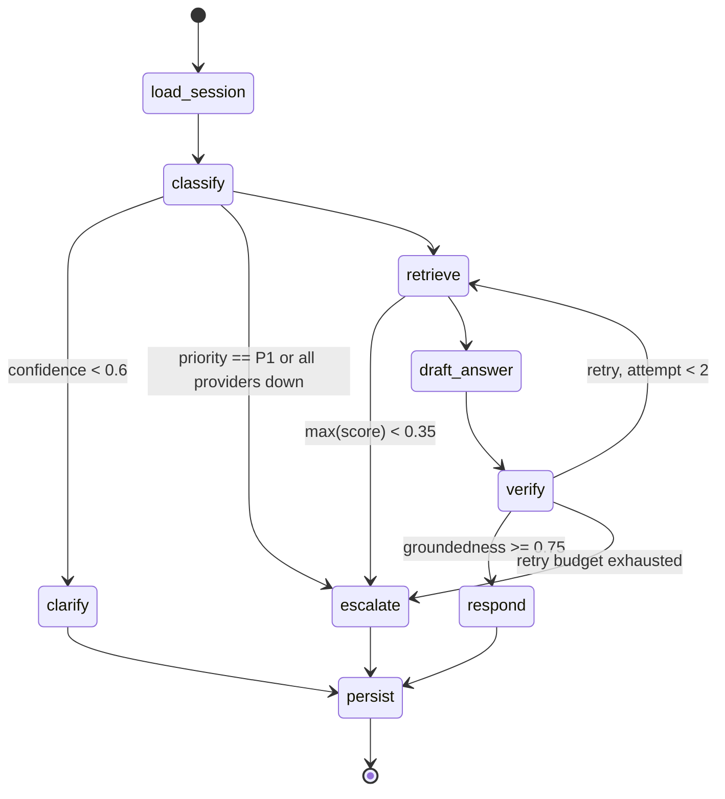

# Agent Workflow

The orchestration is a compiled LangGraph built in `agent/graph.py`. State is the
`TriageState` TypedDict (`agent/state.py`); every node returns a *partial* update and never
mutates globals. Collaborators arrive via `AgentDeps` (`agent/deps.py`), bound to each node
with `functools.partial` so nodes stay `(state) -> dict` for LangGraph while remaining
trivially unit-testable.

## Graph

Every terminal path runs `persist` for auditability (a small, deliberate deviation from the
README diagram, which ended `clarify` directly — persisting the clarify turn keeps the audit
row and `resolution_total` metric consistent across all outcomes).

## Node contracts

| Node | Reads | Writes | LLM alias |
|---|---|---|---|
| `load_session` | `session_id`, `user_input` | `provider` (pinned), `degraded`, `messages`, `customer_ctx`, `attempt=0`, `token_usage` | — |
| `classify` | `user_input` | `category`, `priority`, `confidence`, `entities`, `error_code` | `chat-mini` |
| `clarify` | `user_input` | `clarify_question`, `answer`, `resolution=NEEDS_INFO` | `chat-mini` |
| `retrieve` | `user_input` | `retrieved`, `citations`, `error_code` | — |
| `draft_answer` | `retrieved`, `user_input` | `draft` (or forces escalate on provider failure) | `chat-main` |
| `verify` | `retrieved`, `draft` | `groundedness`, `attempt++`, `error_code` | `chat-mini` |
| `respond` | `draft`, `citations` | `answer`, narrowed `citations`, `resolution=RESOLVED` | — |
| `escalate` | `category`, `priority`, `entities`, `error_code`, `draft` | `resolution=ESCALATED`, `queue`, `ticket`, `answer` | — |
| `persist` | everything | writes turn row; returns `token_usage` | — |

`escalate` also performs the graph's `create_ticket` step by calling the idempotent
`TicketingTool.create_ticket`, and enriches P1 network cases with a simulated
`tools/diagnostics.check_outage` result for the NOC handover.

## Conditional edges

Pure `state -> next` functions in `agent/edges.py`, with thresholds bound from
`agent/policies/thresholds.py` (defaults from settings):

| Edge | Rule |
|---|---|
| `after_classify` | `ALL_PROVIDERS_DOWN` → escalate · `priority==P1` → escalate · `confidence < 0.60` → clarify · else retrieve |
| `after_retrieve` | `not chunks or max(score) < 0.35` → escalate · else draft_answer |
| `after_verify` | `groundedness >= 0.75` → respond · `attempt < 2` → retrieve (retry) · else escalate |

The P1 check precedes the confidence check on purpose: high-priority issues route to a human
regardless of classifier confidence (a Responsible-AI guarantee, see `docs/responsible-ai.md`).

## Provider pinning

`load_session` pins one provider for the whole session (README §4.4 rule 1). The router
(`llm/router.py`) only flips the pin on a genuine failover, at which point it stamps
`degraded=true` and increments `llm_failover_total`. This keeps the classifier and verifier
on the same model within a turn, so the verifier does not reject a good answer because a
mid-graph swap changed the model underneath it.
