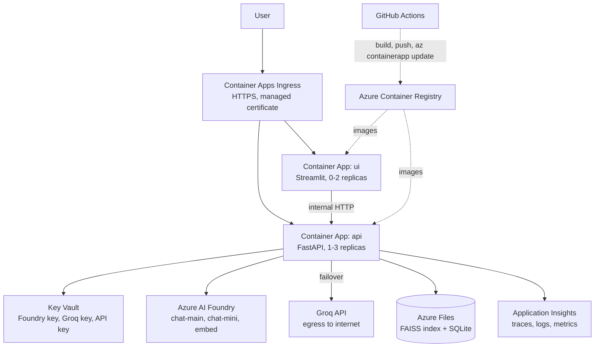

# Azure Deployment Design

Two container images (api, ui) on Azure Container Apps. Provisioning is scripted in
`infra/azure/` (az CLI, not Terraform — README §12). Target-state extras live in
`infra/design/production-topology.md`.

## Resource inventory

| Resource | Purpose | Notes |
|---|---|---|
| Resource Group | blast radius & cleanup boundary | delete the RG to clean up everything |
| Azure AI Foundry resource | `chat-main`, `chat-mini`, `embed` deployments | check regional model availability before Day 1 |
| Container Registry (Basic) | hosts the two images | admin user for the demo; OIDC federation is target state |
| Container Apps Environment | serverless hosting | UI scales to zero to keep overnight cost near nil |
| Azure Files share | FAISS index + SQLite, survives restarts | mounted into the API app at `INDEX_DIR` and the SQLite path |
| Key Vault | Foundry key, Groq key, inbound API key | referenced as Container App secrets |
| Application Insights | traces, logs, metrics, dashboard | `APPLICATIONINSIGHTS_CONNECTION_STRING` env var |
| Log Analytics workspace | backs App Insights, KQL surface | created with the Container Apps environment |

## Identity & secrets

- Secrets live in Key Vault and are injected as Container App secrets → env vars. No key is
  baked into an image.
- `X-API-Key` guards `/v1/*` (`api/middleware/auth.py`).
- HTTPS only via managed ingress certificate.

## Why Container Apps (not AKS or App Service)

AKS is the wrong shape for a 7-day two-service demo — a day of cluster concerns for zero
demo value. App Service works but Container Apps gives scale-to-zero, revision-based
rollback, simple internal service discovery (UI → API over internal HTTP) and a
straightforward secret story. Recorded as a decision here rather than an ADR because it is
a hosting choice, not a code-architecture one.

## Implemented this week

HTTPS only; secrets in Key Vault injected as Container App secrets; API-key auth on `/v1/*`;
per-key rate limiting (`api/middleware/rate_limit.py`); internal-only ingress for the API
where possible; PII redaction in logs (`observability/logging.py`).

## Honestly deferred (say so in the deck)

- Managed identity from Container Apps to Foundry instead of a key.
- Private endpoints + VNet so Foundry traffic never traverses the public internet.
- APIM in front for quotas and per-tenant throttling.
- Entra ID sign-in for support agents with role-based ticket visibility.
- Azure Database for PostgreSQL in place of SQLite-on-Azure-Files (one connection-string
  change behind the repository interface).
