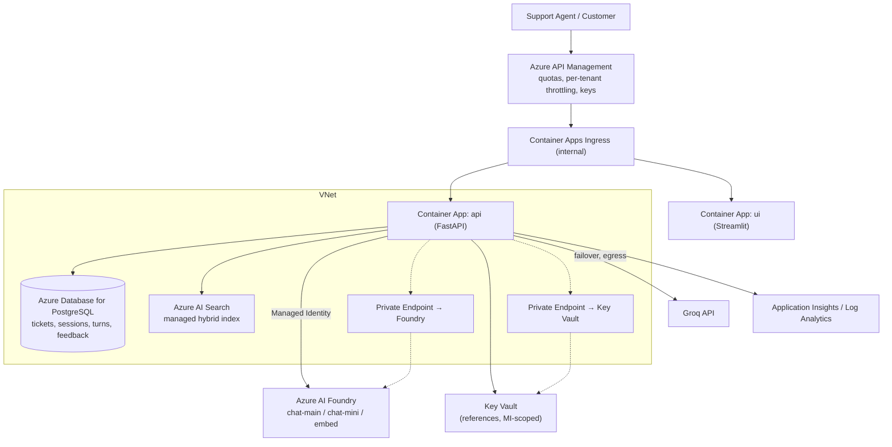

# Production Topology (target state — not built this week)

Naming a cut and designing it scores better than shipping it half-done (README §12). This
is the architecture the 7-day demo deliberately descoped, and how each piece would slot in
without reworking the application.

## Migration map — what changes, and how small the change is

| This week | Target state | Change required in code |
|---|---|---|
| SQLite (WAL) on Azure Files | Azure Database for PostgreSQL Flexible Server | `DATABASE_URL` only — the repository interface and SQLAlchemy models are unchanged. Add Alembic for migrations. |
| FAISS + BM25 local index | Azure AI Search (hybrid, semantic ranker) | New adapter behind the existing `HybridRetriever` interface; `retrieve` node untouched. |
| Foundry key in Key Vault | **Managed identity** from Container Apps → Foundry | Drop `AZURE_AI_API_KEY`; swap `AzureKeyCredential` for `DefaultAzureCredential` in `llm/providers/azure_foundry.py`. No caller changes. |
| Container Apps API-key middleware | **Azure API Management** in front | Remove/relax `ApiKeyMiddleware`; APIM owns keys, quotas, per-tenant throttling. |
| Public ingress | Private endpoints + VNet integration | Foundry, Key Vault, Postgres and Search reached over private link; no public egress except Groq. |
| Admin-user ACR pull | OIDC federation / managed identity pull | Deployment auth change only. |
| Manual Entra-less access | Entra ID sign-in for agents, role-based ticket visibility | UI auth + a role claim read in `middleware/auth.py`. |

## Why these are safe to defer for a 7-day build

- **Concurrency is 1–2 users** in the demo, so SQLite in WAL mode is sufficient; Postgres
  matters when there is production write volume.
- **~40 documents** do not need a managed search index; FAISS + BM25 answer the same
  queries offline and remove a provisioning dependency from the critical path.
- **Keys are faster than managed identity** to get working under time pressure; the
  posture is documented and the swap is one credential object.
- **APIM is a day of learning for zero demo value**; Container Apps ingress + API-key
  middleware covers auth and rate limiting for the demo.

## Reliability & DR (target)

- Multi-replica API behind the environment; UI scales to zero overnight.
- Postgres zone-redundant HA + point-in-time restore.
- Index rebuilt from `data/kb` in CI and published as a versioned artifact; Search index
  reindexed from the same source of truth.
- The Foundry→Groq failover (already implemented) remains the cross-vendor safety net.
